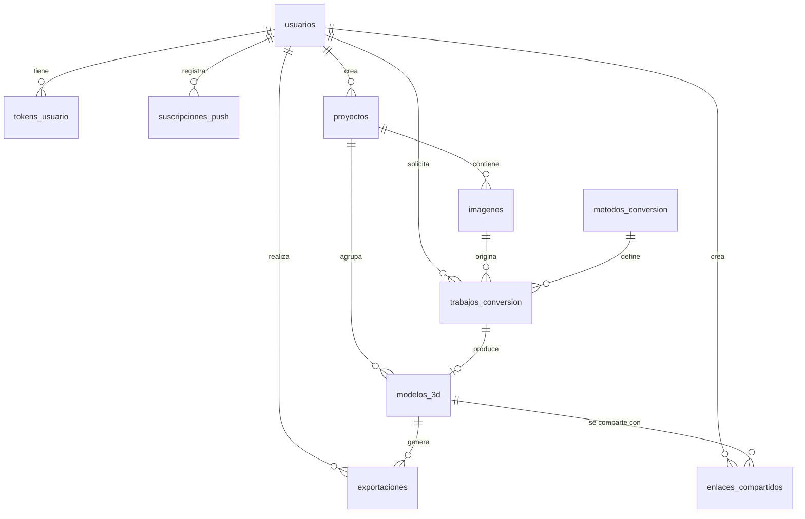

# Modelo entidad-relación — Alzado

Base de datos: MySQL 8 en Clever Cloud (InnoDB, utf8mb4).
El diagrama también está en `03-diagrama-er.mermaid`.

## Diagrama

## Flujo principal

Un usuario crea un **proyecto**, sube una **imagen**, lanza un **trabajo de conversión** con un **método** y parámetros, y el trabajo produce un **modelo 3D**. Ese modelo puede **exportarse** en varios formatos y **compartirse** mediante enlaces.

## Entidades

### usuarios
Personas registradas. El rol distingue usuarios de administradores. `activo = 0` impide iniciar sesión.

### tokens_usuario
Tokens de un solo propósito, guardados siempre como hash: refresco de sesión, recuperación de contraseña y verificación de correo. `tipo` indica el uso; `usado_en` y `revocado_en` controlan su vigencia.

### suscripciones_push
Datos de suscripción Web Push de cada dispositivo del usuario, para avisar cuando termina una conversión. `endpoint_hash` evita duplicados.

### proyectos
Contenedor de trabajo del usuario. El borrado es lógico (`eliminado_en`) y un proceso depura los proyectos con más de 30 días en la papelera.

### imagenes
Imágenes originales subidas a un proyecto. En la base solo se guarda la clave del archivo en el almacenamiento de objetos y sus metadatos, nunca el archivo.

### metodos_conversion
Catálogo de métodos (`relieve`, `objeto_ia`, `extrusion`). `activo` permite habilitar o deshabilitar un método sin tocar el código. `parametros_por_defecto` guarda los valores iniciales en JSON.

### trabajos_conversion
Cola y registro histórico de conversiones. Estados: `pendiente`, `procesando`, `completado`, `fallido`, `cancelado`. Guarda los parámetros usados, el progreso, el proveedor externo (si aplica) y el error si falló.

### modelos_3d
Resultado de un trabajo (relación 1 a 0..1 con `trabajos_conversion`). Cada conversión crea una versión nueva; `es_principal` marca la versión destacada del proyecto. El archivo canónico es un GLB; otros formatos se generan al exportar.

### exportaciones
Historial de descargas por formato (`glb`, `obj`, `stl`).

### enlaces_compartidos
Enlaces públicos de solo lectura. El `token` es aleatorio y único; `expira_en` y `revocado_en` controlan su validez, y `visitas` cuenta los accesos.

## Relaciones y reglas de borrado

| Relación | Cardinalidad | Al borrar el padre |
|---|---|---|
| usuarios → tokens_usuario | 1 a N | Se eliminan (CASCADE) |
| usuarios → suscripciones_push | 1 a N | Se eliminan (CASCADE) |
| usuarios → proyectos | 1 a N | Se eliminan (CASCADE) |
| proyectos → imagenes | 1 a N | Se eliminan (CASCADE) |
| proyectos → modelos_3d | 1 a N | Se eliminan (CASCADE) |
| imagenes → trabajos_conversion | 1 a N | Se eliminan (CASCADE) |
| metodos_conversion → trabajos_conversion | 1 a N | Se impide el borrado (RESTRICT) |
| usuarios → trabajos_conversion | 1 a N | Se eliminan (CASCADE) |
| trabajos_conversion → modelos_3d | 1 a 0..1 | Se eliminan (CASCADE) |
| modelos_3d → exportaciones | 1 a N | Se eliminan (CASCADE) |
| modelos_3d → enlaces_compartidos | 1 a N | Se eliminan (CASCADE) |
| usuarios → exportaciones / enlaces_compartidos | 1 a N | Se eliminan (CASCADE) |

## Notas de diseño

- Los archivos (imágenes, GLB, miniaturas) viven en almacenamiento de objetos; la base guarda claves y metadatos.
- Los tokens y la huella del endpoint push se guardan como hash SHA-256 en `CHAR(64)`.
- Los identificadores son `BIGINT UNSIGNED` autoincrementales; los enlaces públicos usan su propio `token` aleatorio para no exponer ids.
- Las columnas de parámetros usan JSON porque cambian según el método de conversión.
